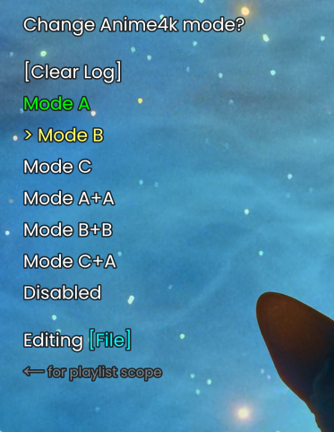
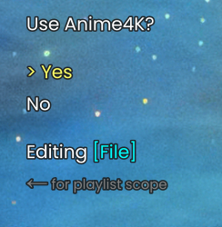
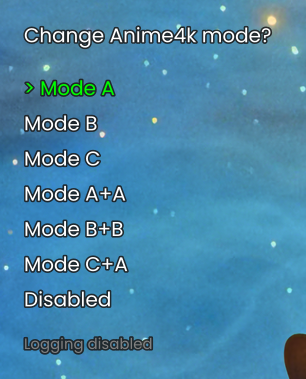

# auto4k.lua

Script to remember Anime4K (https://github.com/bloc97/Anime4K) status by generating and reading a log file.



* Can apply and remember Anime4K mode to a file or a whole playlist.

* Once an unrecognized file loads, a menu will ask if you want to use Anime4K for the file/playlist.



* Includes a bindable menu to check the active mode and change it.

* Can disable logging. While it removes most of the script's features, it's still useful to check the current Anime4K mode.



## Install

Put auto4k.lua in the `MPV/scripts` folder.

### Changes to input.conf

For the script to work correctly, you need to override the Anime4K input commands in your `input.conf` with these custom ones:

```
Ctrl+1 script-binding auto4k-A
Ctrl+2 script-binding auto4k-B
Ctrl+3 script-binding auto4k-C
Ctrl+4 script-binding auto4k-AA
Ctrl+5 script-binding auto4k-BB
Ctrl+6 script-binding auto4k-CA
Ctrl+7 script-binding auto4k-clear
```
and
```
[your keybind] script-binding display-auto4k
```

to display the menu manually.

You can also delete the `glsl_shaders=` line in `mpv.conf`, as it is superseded by the script, except if you're running it without logging.

### Options

Comes with configurable options:

```ini
# enables logging
# if disabled, shaders will default to the ones defined in mpv.conf on each launch and never remember changes
# the menu will still be able to detect which mode you're in and switch modes
enable_logging=yes
# log file path, default in mpv config's root folder
log_path=~~home/auto4k.log
# anime4k shaders path. if installed correctly in MPV/shaders/, don't touch anything
shader_path=~~/shaders/
# auto displays the menu on an unrecognized file
auto_run=yes
# draw a simple yes/no menu on unrecognized file, or all modes
menu_yes_no=yes
# the mode that will be activated if you choose yes. A, B, C, A+A, B+B, or C+A
default_yes_mode=A
# whether the choices will edit the whole playlist by default or not 
default_playlist=yes
# include A+A, B+B, C+A modes in the choices
include_secondary_modes=yes
# font size of the menu
font_size=100
# cull oldest entries of the log if it goes beyond this number of lines
max_log_lines=1000
```

Put in auto4k.conf in `MPV/script-opts`. A sample file is available.

# recent.lua

Fork from https://github.com/hacel/recent.

* Added youtube playlist support and log culling feature.
* Changed the overlay appearance to look like Blackbox.
* Added item timestamp prefix to list

# (WIP) help.lua

Displays a list of mpv's commands and their associated keybinds. Doesn't work for now, don't download.