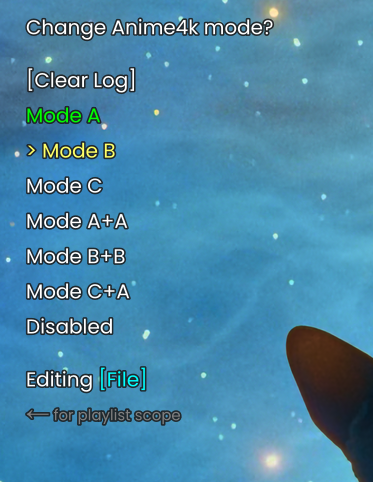
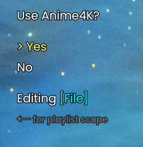
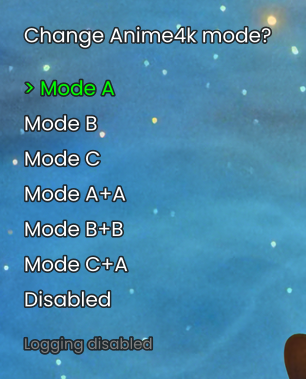
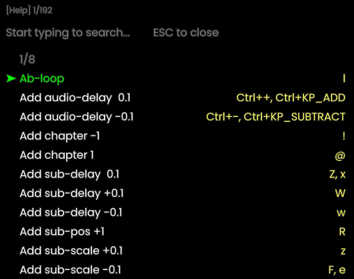
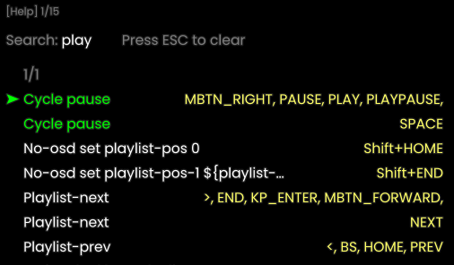

* [auto4k.lua](#auto4klua)
    * [Install](#install)
        * [Changes to input.conf](#changes-to-inputconf)
        * [Options](#options)
* [help.lua](#helplua)
    * [Install](#install-1)
        * [Bind the script in input.conf](#bind-the-script-in-inputconf)
        * [Options](#options-1)
* [scroll-list.lua](#scroll-listlua)
* [recent.lua](#recentlua)
* [track-list.lua](#track-listlua)
* [Blackbox.js](#blackboxjs)
* [modernx.lua](#modernxlua)

# auto4k.lua

Script to remember Anime4K (https://github.com/bloc97/Anime4K) status by generating and reading a log file.



* Can apply and remember Anime4K mode to a file or a whole playlist.
* Once an unrecognized file loads, a menu will ask if you want to use Anime4K for the file/playlist.



* Includes a bindable menu to check the active mode and change it.
* Can disable logging. While it removes most of the script's features, it's still useful to check the current Anime4K mode.



## Install

Put `auto4k.lua` in your `mpv/scripts` folder and [install `scroll-list.lua`](#install-2).

### Changes to input.conf

For the script to work correctly, you need to override the Anime4K input commands in your `input.conf` with these custom ones:

```
Ctrl+1 script-binding auto4k-A
Ctrl+2 script-binding auto4k-B
Ctrl+3 script-binding auto4k-C
Ctrl+4 script-binding auto4k-AA
Ctrl+5 script-binding auto4k-BB
Ctrl+6 script-binding auto4k-CA
Ctrl+7 script-binding auto4k-clear
```
and
```
[your keybind] script-binding display-auto4k
```

to display the menu manually.

You can also delete the `glsl_shaders=` line in `mpv.conf`, as it is superseded by the script, except if you're running it without logging.

### Options

Comes with configurable options:

```ini
# enables logging
# if disabled, shaders will default to the ones defined in mpv.conf on each launch and never remember changes
# the menu will still be able to detect which mode you're in and switch modes
enable_logging=yes
# log file path, default in mpv config's root folder
log_path=~~home/auto4k.log
# anime4k shaders path. if installed correctly in mpv/shaders/, don't touch anything
shader_path=~~/shaders/
# auto displays the menu on an unrecognized file
auto_run=yes
# draw a simple yes/no menu on unrecognized file, or all modes
menu_yes_no=yes
# the mode that will be activated if you choose yes. A, B, C, A+A, B+B, or C+A
default_yes_mode=A
# whether the choices will be in playlist scope by default or not
default_playlist=yes
# include A+A, B+B, C+A modes in the choices
include_secondary_modes=yes
# font size of the menu
font_size=100
# cull oldest entries of the log if it goes beyond this number of lines
max_log_lines=1000
```

Put in `script-opts/auto4k.conf`. A sample file is available on this repo.

# help.lua

Displays a list of mpv's commands and their associated keybinds.



* Navigable with arrows.
* Press `ENTER` to run the selected command.
* Search function that matches both commands and keybinds.



Only currently active binds are displayed. If a script or any other condition overwrite a bind, you won't see the overwritten bind.

## Install

Put `help.lua` in your `mpv/scripts`.

### Bind the script in input.conf

Script's default hotkey is `h`. If you want to modify or remove it, add an `input.conf` entry:

```
[your keybind] script-binding toggle-help
```

### Options

Tweak these options to make the list correctly display on your mpv window:

```ini
# key that brings the list up
bind=h
# number of entries listed per column, the column number header sitting on top
max_lines=27
# max number of characters on one line, command and keys together
max_char=50
# number of columns shown at once. the list scrolls sideways through the rest
max_columns=3
# font scale of the entries, in percent
font_scale=100
# font scale of the title, in percent
title_font_scale=75
# font scale of the search line, in percent. the columns start below whatever
# room it needs, so raising this pushes them down instead of overlapping them
search_font_scale=100
# colors, written the way ass wants them: hex, blue-green-red
font_color=HFFFFFF
title_font_color=H808080
# color of the keys, on the right of each entry
font_bind_color=H66FFFF
# color of the entry the cursor is on
cursor_font_color=H00FF00
# color of the "Script" word heading script bindings
script_font_color=HAAAAFF
# margins, in canvas units. the canvas is 720 units tall, whatever the window
margin_x=20
margin_y=20
# gap kept between two columns, in canvas units
column_gap=30
```

Put in `script-opts/help.conf`. A sample file is available on this repo.

# scroll-list.lua

Dependency for creating navigable lists.
All scripts using it also expose the following options: 

```ini
# ass style applied to the whole overlay
global_style=
# ass style for the list header line
header_style={\q2\fs35\c&00ccff&}
# ass style for each list entry
list_style={\q2\fs25\c&Hffffff&}
# ass style for the "N item(s) above/remaining" wrapper text
wrapper_style={\c&00ccff&\fs16}
# color used by wrapper_style, exposed separately for scripts that need to
# resize/rescale wrapper_style but keep the same color
wrapper_color=&00ccff&
# ass style for the cursor
cursor_style={\c&00ccff&}
# ass style applied to the selected line
selected_style={\c&Hfce788&}
# cursor glyph shown next to the selected line
cursor=➤\h
# indent used for non-selected lines
indent=\h\h\h\h
# secondary marker shown when an item sets `.active` (true/false), independent
# of the cursor position (e.g. "currently active choice" vs "keyboard cursor
# position"). Left blank by default so lists that never set `.active` render
# exactly as before.
active_marker=
inactive_marker=
# max number of visible entries before scrolling
num_entries=16
# whether scrolling past the top/bottom wraps around
wrap=false
# text shown when the list is empty
empty_text=no entries
# always reserve vertical space for the "N item(s) above/remaining" lines so
# the list doesn't shift up/down as they appear/disappear while scrolling
reserve_wrapper_lines=true
```

### Install

Put `scroll-list.lua` in your `mpv/script-modules/` folder, create if needed.

# recent.lua

Modified [recent](https://github.com/hacel/recent).

Now requires `script-modules/scroll-list.lua`.

* Added youtube playlist support.
* Added log culling feature.
* Changed the overlay appearance to match other scripts.
* Added item timestamp prefix to list.

# track-list.lua

Modified [track-list](https://github.com/dyphire/mpv-scripts/blob/main/track-list.lua).

Requires `script-modules/scroll-list.lua`.

* Resolves the scroll-list.lua dependency relative to the script's own file location instead of through mpv's `~~` config-dir expansion for portability.

# Blackbox.js

Modified [Blackbox](https://github.com/VideoPlayerCode/mpv-tools)

* Modified menu draw logic to not overlap other script menus.
* Changed ascii symbol navigation with more modern symbols.
* Menus now hide on file load.

## Install

Install [Blackbox](https://github.com/VideoPlayerCode/mpv-tools) first. Copy `Blackbox.js` in your `mpv/scripts` folder and `modules.js/` folder in your `mpv/` folder, overwrite when asked.

# modernx.lua

Modified [ModernX](https://github.com/cyl0/ModernX/) to not overlap script menus with mpv's logo.